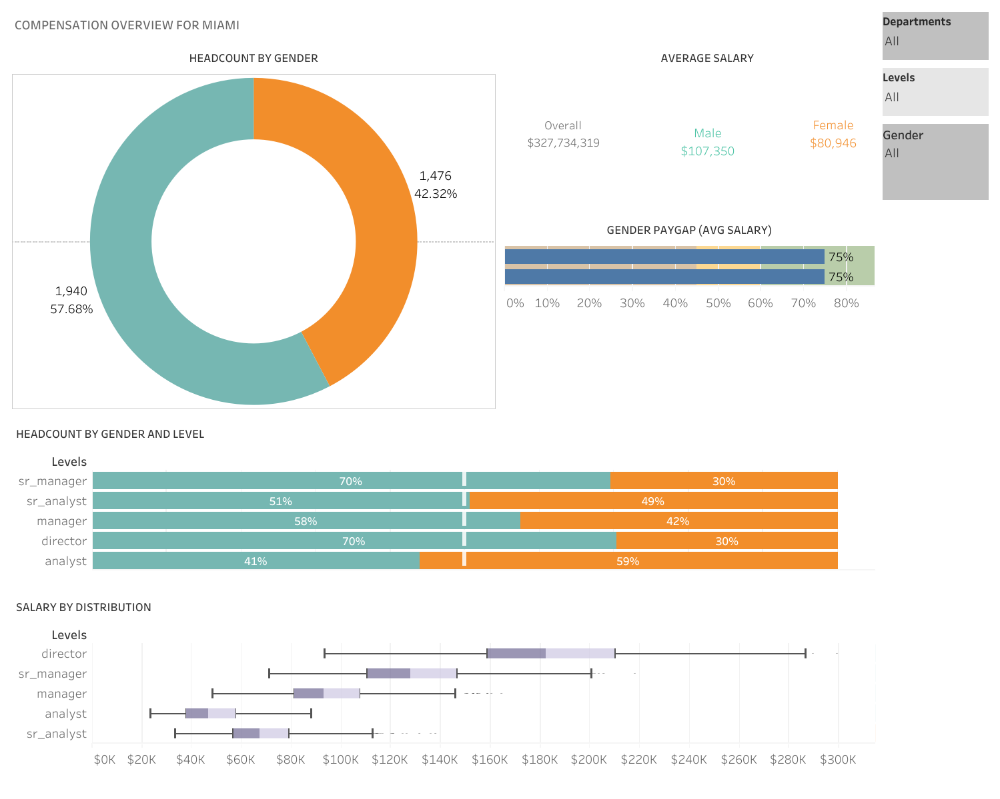

# Tableau Compensation Analytics Dashboard

This project analyzes employee compensation data using Tableau to explore salary trends, workforce composition, and gender pay equity across departments and job levels.

## Project Overview

The dashboard was designed to provide clear compensation insights for decision-makers by visualizing workforce data such as salary distribution, headcount by gender, and pay gap comparisons.

This project demonstrates how data visualization can transform raw employee data into meaningful insights that support business decision-making.

## Dashboard Preview

## Live Interactive Dashboard

View the fully interactive Tableau dashboard here:

https://public.tableau.com/app/profile/ise.oluwa.ishola/viz/DatavisualizationforC-suite/Dashboard1

## Key Insights

- Headcount distribution by gender
- Average salary comparison between male and female employees
- Gender pay gap analysis
- Salary distribution across job levels
- Workforce breakdown across departments
- Interactive filters for gender, department, and job level

## Dataset

The dataset used for this analysis is included in the repository:

Employee-Compensation-Data.xlsx

## Tools Used

- Tableau
- Microsoft Excel
- Data Visualization
- Business Intelligence Analysis

## What This Project Demonstrates

This project highlights my ability to:

- Analyze workforce and compensation data
- Design business-focused dashboards
- Communicate insights visually using Tableau
- Build interactive dashboards for decision-makers

## Summary

This dashboard simulates the type of compensation and workforce reporting often used by leadership teams and HR analytics departments. It demonstrates how Tableau can be used to analyze pay equity, workforce distribution, and salary trends through clear and interactive visualizations.
